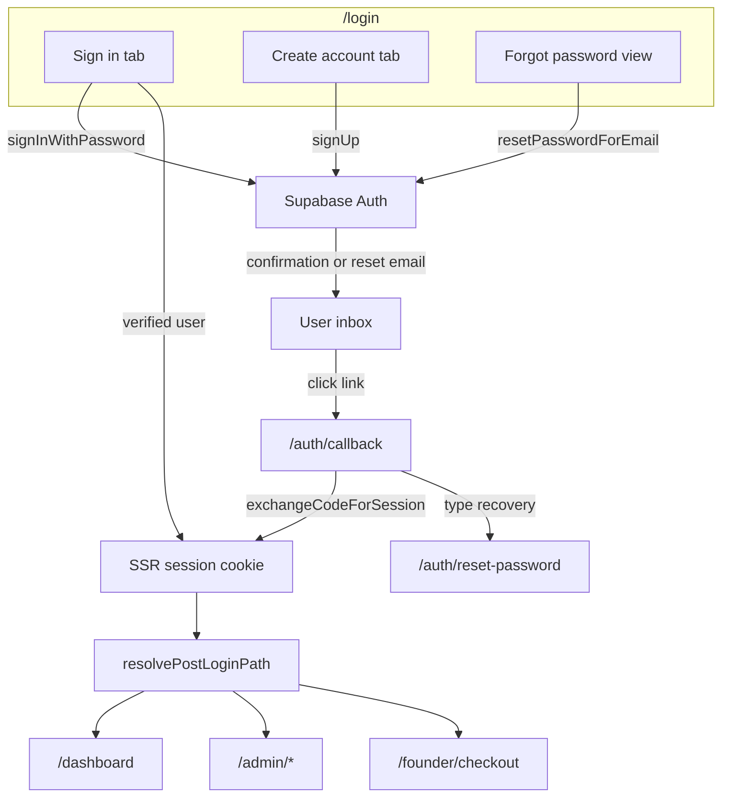

# Email + Password Auth Design

Date: 2026-05-28  
Status: Implemented  
Supersedes: [2026-05-28-email-otp-auth-design.md](./2026-05-28-email-otp-auth-design.md) (OTP login removed)  
Related: [2026-05-27-founder-access-mvp-design.md](./2026-05-27-founder-access-mvp-design.md), [2026-05-28-universal-landing-page-design.md](./2026-05-28-universal-landing-page-design.md)

## Goal

Replace OTP and magic-link login with **email + password** authentication via Supabase Auth. Users sign up openly, confirm their email once, then sign in with a password on every visit — no codes, no magic links for routine login.

## Product decisions (locked)

| Decision | Choice |
|---|---|
| Sign-up access | **Open** — anyone can create an account |
| Email verification | **Required** before sign-in works |
| UI | Single `/login` page with **Sign in** \| **Create account** tabs |
| OTP / magic-link login | **Removed entirely** from app UI and code |
| Recovery | Forgot-password reset email only |
| Identifier | **Email + password** (Supabase standard — no separate username field) |
| Auth provider | Keep Supabase Auth (JWT, SSR cookies, middleware) |
| Admin access | Unchanged — `ADMIN_EMAILS` allowlist + session |
| Subscription gating | Unchanged — middleware + `/api/me/subscription` |

## Why password auth over OTP

| Concern | OTP / magic link | Email + password |
|---|---|---|
| Daily login friction | Request code, check email, enter digits | Type email + password on `/login` |
| Email client dependency | Every login requires inbox access | Only for signup confirmation and password reset |
| PKCE / in-app browser issues | Magic-link login fails in Gmail/Outlook in-app browsers | Login is form-based; no PKCE on routine sign-in |
| User expectation | Unfamiliar for a product dashboard | Standard, predictable |

Email confirmation and password-reset links still use email clicks (one-time events), which is acceptable because day-to-day login does not depend on them.

## Architecture

### Unchanged

- Supabase Auth + `@supabase/ssr` middleware
- FastAPI `get_current_user` + `SUPABASE_JWT_SECRET`
- `ADMIN_EMAILS` on web middleware and API
- `resolvePostLoginPath()` post-login routing
- Stripe checkout, webhooks, 50-seat cap
- Route gating in `middleware.ts`

### Changed

- Primary sign-in: `signInWithPassword` instead of `signInWithOtp` / `verifyOtp`
- New `AuthCredentialsForm` replaces `AuthOtpForm`
- New `/auth/reset-password` page for password updates after reset link
- `/auth/callback` handles confirmation + recovery redirects only (not login)
- Supabase dashboard: email provider ON, confirm email ON, updated email templates
- Marketing copy: "email + password" instead of magic link / OTP

## Implementation approach

**Recommended: client-side Supabase auth form (Approach 1)**

Replace `AuthOtpForm` with `AuthCredentialsForm` calling:

- `signUp({ email, password, options: { emailRedirectTo } })`
- `signInWithPassword({ email, password })`
- `resetPasswordForEmail({ email, redirectTo })`

Keep `/auth/callback` for email confirmation and password reset code exchange. Reuse `resolvePostLoginPath` after successful sign-in.

Alternatives considered and rejected:

- **Server Actions for sign-up/sign-in** — more refactor for little gain; reset flow still needs client callback page
- **Separate `/signup` route** — conflicts with single-page tab UX preference

## Login page UX — `/login`

### Layout

Single panel inside `AppShell`, max-width ~520px. Three modes: tab toggle (Sign in | Create account) and a forgot-password sub-view.

Default tab: **Sign in**. `?mode=signup` opens Create account tab. `?confirmed=1` shows banner on Sign in tab: "Email confirmed — you can sign in now."

### Sign in tab

| Field | Rules |
|---|---|
| Email | Required, standard email validation |
| Password | Required, min 8 characters (client hint; Supabase enforces server-side) |

- **Primary button:** Sign in
- **Links:** Forgot password? (inline view); Become a Founder → `/founder/checkout`
- **On success:** `resolvePostLoginPath({ next, accessToken })` → `router.push(path)`

| Supabase error | User-facing copy |
|---|---|
| Invalid credentials | Email or password is incorrect. |
| Email not confirmed | Check your inbox and confirm your email before signing in. (include resend) |
| Rate limited | Too many attempts. Wait a minute and try again. |
| Invalid API key | Copy fresh anon key from Supabase into `.env.local` and restart dev server |

### Create account tab

| Field | Rules |
|---|---|
| Email | Required, validated |
| Password | Required, min 8 characters |
| Confirm password | Required, must match |

- **Primary button:** Create account
- **On success:** "Check your email" state — no session until confirmed
- **Resend confirmation:** 60s cooldown
- **Inline hint:** At least 8 characters

### Forgot password view

Inline on `/login` (not a separate route). Email field + **Send reset link**.

- **On success:** Generic copy — "If an account exists for {email}, we sent a password reset link."
- Reset link: `resetPasswordForEmail` with `redirectTo: {SITE_URL}/auth/callback?next=/auth/reset-password`

### `/auth/reset-password` (new page)

After reset link exchanges code via callback:

| Field | Rules |
|---|---|
| New password | Min 8 characters |
| Confirm password | Must match |

- **Button:** Update password → `supabase.auth.updateUser({ password })` → redirect `/login?mode=signin` with success message

### URL params

| Param | Behavior |
|---|---|
| `?next=/dashboard` | Passed to post-login routing |
| `?mode=signup` | Opens Create account tab |
| `?confirmed=1` | Sign in tab success banner after email confirmation |

### Accessibility

- Tab buttons: `role="tablist"`, `aria-selected`
- Password fields: show/hide toggle
- Inputs: min-height 44px; reuse existing CSS vars (`--border`, `--green`, `--navy`, `--muted`)

## `/auth/callback` behavior

Keep route; narrow responsibility to email-driven flows only:

| Flow | After `exchangeCodeForSession` |
|---|---|
| Email confirmation (signup) | Redirect `{SITE_URL}/login?confirmed=1` |
| Password recovery | Redirect `{SITE_URL}/auth/reset-password` (session established for `updateUser`) |
| Legacy / unknown | Redirect `{SITE_URL}/login` |

Do **not** use callback as primary login path.

## Founder welcome — `/founder/welcome`

After Stripe payment confirms:

1. Poll subscription as today
2. If no session: show `AuthCredentialsForm` (Sign in tab default, email prefilled from checkout)
3. User may switch to Create account tab if they have not registered
4. Copy: "Payment confirmed — sign in with your account to open your dashboard."
5. No auto `signInWithOtp` or magic link on mount

## Supabase dashboard configuration

### Auth provider settings

| Setting | Value |
|---|---|
| Email provider | Enabled |
| Confirm email | ON |
| Secure email change | ON |
| Minimum password length | 8 |
| Enable sign-ups | ON |

### Redirect URLs

Add to Authentication → URL Configuration:

- `{SITE_URL}/auth/callback`
- `{SITE_URL}/auth/reset-password`
- `{SITE_URL}/login`

Include production and local dev URLs (e.g. `http://localhost:3001`).

### Email templates

**Confirm signup**

- Subject: `Confirm your SMB Funding Navigator account`
- Body: CTA via `{{ .ConfirmationURL }}`
- Copy: confirm email, then sign in with password
- Remove `{{ .Token }}` — not used

**Reset password**

- Subject: `Reset your SMB Funding Navigator password`
- Body: CTA via `{{ .ConfirmationURL }}`
- Copy: link expires in 1 hour; ignore if not requested

### Environment variables (no new vars)

| Variable | Notes |
|---|---|
| `NEXT_PUBLIC_SUPABASE_URL` | Web + API same project |
| `NEXT_PUBLIC_SUPABASE_ANON_KEY` | Fresh anon key |
| `SUPABASE_JWT_SECRET` | JWT signing secret from API settings — not service role key |
| `NEXT_PUBLIC_SITE_URL` | Used in `emailRedirectTo` and reset redirects |

## Components and files

| File | Change |
|---|---|
| `apps/web/components/auth-credentials-form.tsx` | **New** — tabs, sign-in, sign-up, forgot-password |
| `apps/web/app/login/page.tsx` | Replace `AuthOtpForm` with `AuthCredentialsForm` |
| `apps/web/app/auth/reset-password/page.tsx` | **New** — set new password after reset link |
| `apps/web/app/auth/callback/route.ts` | Confirmation → `/login?confirmed=1`; recovery → `/auth/reset-password` |
| `apps/web/app/founder/welcome/page.tsx` | Replace OTP with credentials form |
| `apps/web/components/founder-tier-card.tsx` | Bullet: email + password login |
| `apps/web/components/auth-otp-form.tsx` | **Delete** |

## Error handling

| Case | User message |
|---|---|
| Invalid credentials | Email or password is incorrect. |
| Email not confirmed | Confirm your email first. (+ resend) |
| Sign-up, email taken | An account with this email already exists. Try signing in. |
| Reset for unknown email | If an account exists for {email}, we sent a reset link. |
| Weak password | Password must be at least 8 characters. (or Supabase message) |
| Expired reset link | This link expired. Request a new reset link. |
| Rate limited | Too many attempts. Wait a minute and try again. |
| Verified but API subscription check fails | Signed in; redirect to checkout |

## Security

- Password minimum 8 characters (Supabase + client validation)
- Email confirmation required before sign-in
- Password reset links single-use, time-limited (Supabase default)
- Do not leak email existence on forgot-password (generic confirmation copy)
- Rate limits: Supabase Auth built-in; no custom backend for MVP

## Testing checklist

1. Sign up → confirmation email → click link → `/login?confirmed=1` → sign in → correct redirect
2. Sign in with wrong password → error, no session
3. Sign in before confirming → blocked with resend prompt
4. Forgot password → reset email → set new password → sign in with new password
5. Admin email, no subscription → `/admin/leads`
6. Founder with active sub → `/dashboard`
7. Non-founder, no sub → `/founder/checkout`
8. Post-checkout `/founder/welcome` → password sign-in (not OTP)
9. Gated routes redirect to `/login?next=…`
10. `npm run build` passes

## Out of scope

- OAuth (Google, Microsoft)
- Separate username field (non-email)
- OTP / magic-link login
- SMS or 2FA
- Supabase project migration (separate infra task)
- Replacing Supabase with Clerk/Auth0

## Relationship to prior specs

This spec changes **only how users establish a session**. It does not change:

- Waitlist capture, Stripe Checkout, or webhooks
- Wizard paywall or blurred preview
- Founder cap enforcement
- Dashboard or admin feature set

Supersedes auth portions of [2026-05-28-email-otp-auth-design.md](./2026-05-28-email-otp-auth-design.md). Funnel step "OTP → dashboard" becomes "password sign-in → dashboard" on welcome and login pages.
